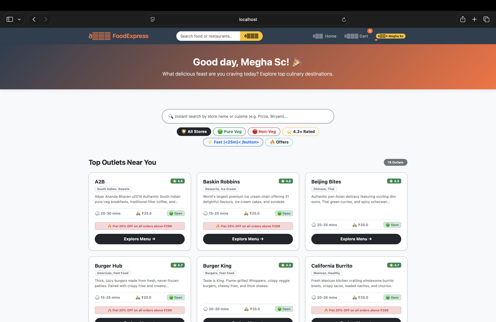
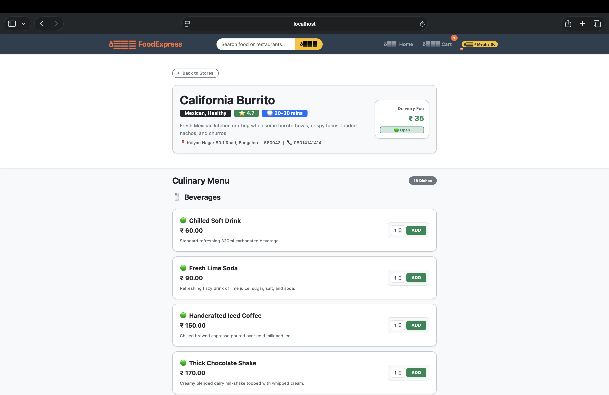
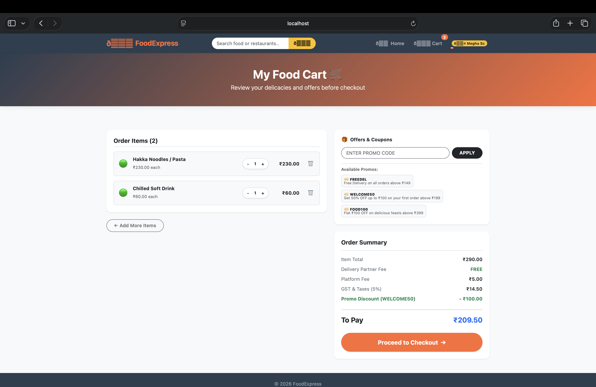
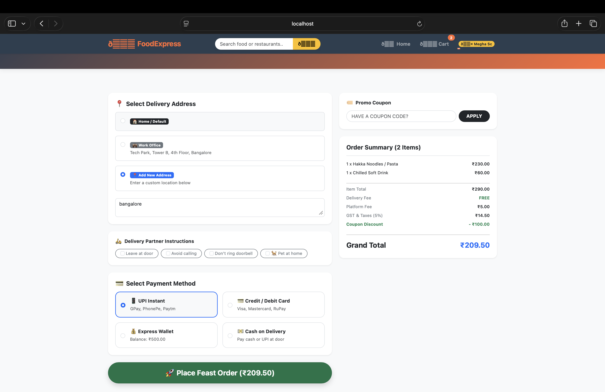
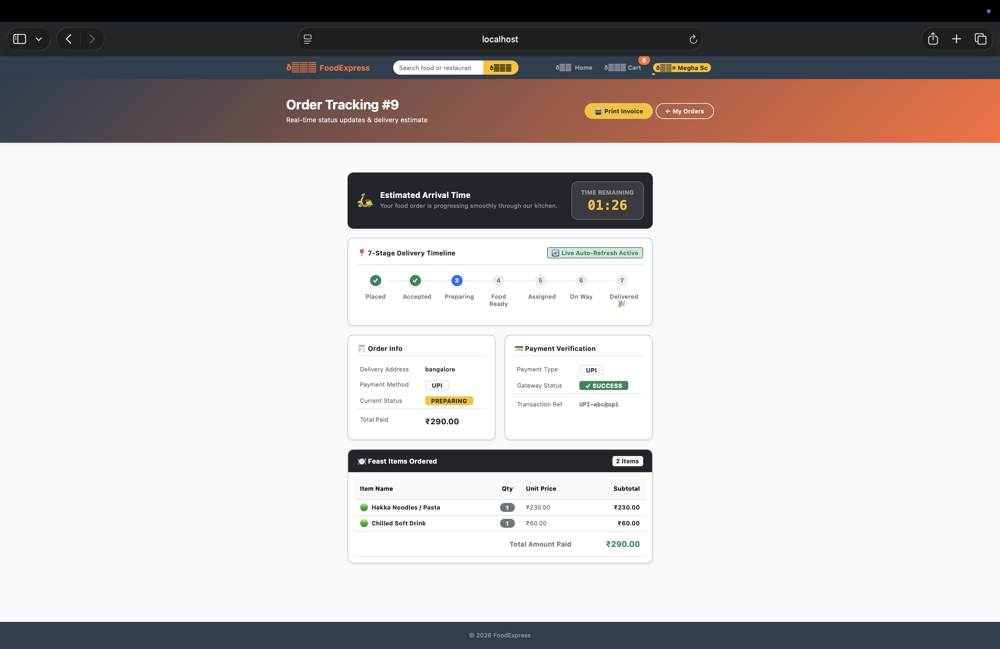
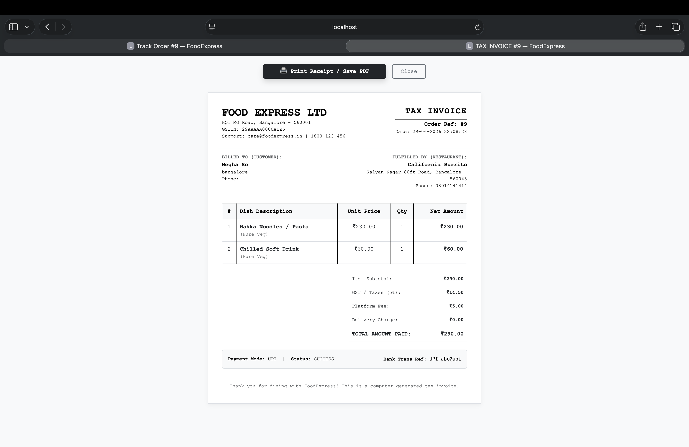
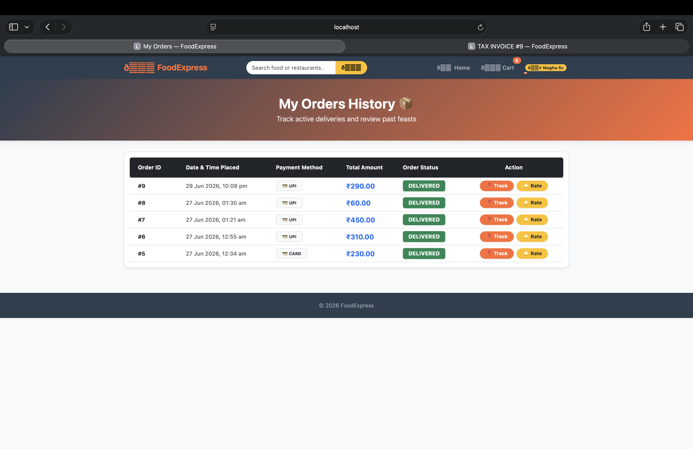

# Online Food Delivery System (Java MVC)

A full-stack web application developed using **Java 17**, **Jakarta Servlets**, **JSP**, **JDBC**, and **MySQL**, following the **Model-View-Controller (MVC)** architectural pattern.

The application provides a complete food ordering experience where customers can register, browse restaurants, order food, complete payments, track deliveries, and download invoices. It also includes an administrator portal for managing restaurants, menus, customer orders, and dashboard statistics.

The project follows a layered architecture to separate presentation, business logic, and database operations, making the application easier to maintain and extend.

---

## About the Project

The Online Food Delivery System was developed to demonstrate the implementation of a complete Java web application using the MVC architecture.

The application simulates the workflow of a food delivery platform by allowing customers to explore restaurants, place food orders, complete simulated payments, and monitor order progress. Administrators can manage restaurants, food items, and customer orders through a dedicated dashboard.

The project emphasizes clean architecture, modular design, secure authentication, and efficient database interaction using JDBC.

---

## Key Features

## Customer Module

- User Registration
- Secure Login & Logout
- Session Management
- Browse Restaurants
- Search Restaurants
- View Restaurant Menus
- Add Food Items to Cart
- Update Cart Quantity
- Remove Items from Cart
- Single Restaurant Cart Validation
- Coupon Support
- Checkout Process
- Payment Simulation (COD, UPI, Card)
- Order Tracking
- Invoice Generation
- My Orders

---

##  Administrator Module

- Administrator Login
- Dashboard Overview
- Restaurant Management
- Food Item Management
- Order Management
- Delivery Status Updates
- Revenue Summary
- Customer Statistics

---

##  Technical Features

- MVC Architecture
- Layered Application Design
- DAO Pattern
- Service Layer
- JDBC with Prepared Statements
- BCrypt Password Hashing
- Session-Based Authentication
- Responsive Bootstrap Interface
- Maven Build System
- Apache Tomcat Deployment
- MySQL Database Integration

---

#  Technology Stack

| Category | Technology |
|----------|------------|
| Language | Java 17 |
| Architecture | Model-View-Controller (MVC) |
| Frontend | JSP, HTML5, CSS3, Bootstrap 5, JavaScript |
| Backend | Jakarta Servlets |
| Database | MySQL 8 |
| Database Connectivity | JDBC |
| Build Tool | Maven |
| Web Server | Apache Tomcat 10 |
| Security | BCrypt |
| Version Control | Git & GitHub |

---

# Project Highlights

- Developed using the MVC architectural pattern.
- Layered project structure with Controller, Service, DAO, and Model layers.
- Secure authentication using BCrypt password hashing.
- Session-based user authentication and authorization.
- Single restaurant cart validation to prevent mixed orders.
- Coupon support during checkout.
- Simulated payment methods (Cash on Delivery, UPI, and Card).
- Real-time order tracking with delivery status progression.
- Printable invoice generation after successful orders.
- Administrator dashboard for restaurant and order management.
- Responsive user interface built with Bootstrap.

#  Application Preview

The screenshots below illustrate the complete customer journey, from account creation to order completion.

## User Registration

New users can create an account to access the platform.


---

## User Login

Secure login using email and password.


---

## Home

Browse restaurants, search by name, and explore available dining options.



---

## Restaurant Menu

View restaurant details, menu items, pricing, and add food to the cart.



---

## Shopping Cart

Review selected items, update quantities, apply coupons, and proceed to checkout.



---

## Checkout

Confirm delivery details and review the complete order summary.



---

## Payment

Choose a preferred payment method and complete the simulated payment process.


---

## Order Tracking

Track the order through each delivery stage until completion.



---

## Invoice

Generate and print the invoice for completed orders.



---

## My Orders

View previous orders and monitor their current status.



---

#  MVC Architecture

The project follows the **Model–View–Controller (MVC)** architectural pattern to maintain a clear separation between presentation, business logic, and database operations.

```text
                   Browser
                      │
                      ▼
                JSP Pages (View)
                      │
                      ▼
          Jakarta Servlets (Controller)
                      │
                      ▼
            Service Layer (Business Logic)
                      │
                      ▼
        DAO Layer (Database Operations)
                      │
                      ▼
                 MySQL Database
```

### Model

The Model layer represents the application's core entities.

Examples include:

- User
- Restaurant
- FoodItem
- Cart
- CartItem
- Order
- OrderItem
- Payment
- Coupon

---

### View

The View layer is implemented using JSP pages and Bootstrap.

It is responsible for:

- Rendering user interfaces
- Displaying restaurant listings
- Showing menus
- Managing the shopping cart
- Checkout and payment pages
- Order tracking
- Invoice display
- Administrator pages

---

### Controller

The Controller layer consists of Jakarta Servlets.

Responsibilities include:

- Processing HTTP requests
- Validating user input
- Managing user sessions
- Invoking business services
- Redirecting and forwarding requests
- Coordinating communication between the View and Service layers

---

#  Application Workflow

### Customer Workflow

```text
Register
      │
      ▼
Login
      │
      ▼
Browse Restaurants
      │
      ▼
Restaurant Menu
      │
      ▼
Add Items to Cart
      │
      ▼
Checkout
      │
      ▼
Payment
      │
      ▼
Order Placed
      │
      ▼
Order Tracking
      │
      ▼
Invoice
      │
      ▼
My Orders
```

---

### Administrator Workflow

```text
Admin Login
      │
      ▼
Dashboard
      │
      ├── Manage Restaurants
      ├── Manage Food Items
      ├── Manage Orders
      └── Monitor Revenue
```

---

# Project Structure

```text
OnlineFoodDelivery-Java-MVC
│
├── database/
│   └── food_delivery_db.sql
│
├── docs/
│
├── screenshots/
│
├── src/
│   └── main/
│       ├── java/
│       │   └── com.fooddelivery/
│       │       ├── controller/
│       │       ├── dao/
│       │       │   └── impl/
│       │       ├── model/
│       │       ├── service/
│       │       │   └── impl/
│       │       └── util/
│       │
│       └── webapp/
│           ├── assets/
│           │   ├── css/
│           │   └── js/
│           │
│           ├── WEB-INF/
│           │   ├── views/
│           │   └── web.xml
│           │
│           └── index.jsp
│
├── pom.xml
├── README.md
└── .gitignore
```

#  Database Design

The application uses **MySQL 8** as its relational database. The schema is designed to support user management, restaurant management, food ordering, payments, and order tracking while maintaining data integrity through primary and foreign key relationships.

### Database Tables

| Table | Purpose |
|--------|---------|
| `users` | Stores customer and administrator accounts |
| `restaurants` | Stores restaurant information |
| `food_items` | Stores menu items for each restaurant |
| `cart` | Stores customer shopping carts |
| `cart_items` | Stores food items added to the cart |
| `orders` | Stores order details |
| `order_items` | Stores ordered food items |
| `payments` | Stores payment information |
| `coupons` | Stores available coupon codes |

The complete SQL script is available in:

```text
database/food_delivery_db.sql
```

---

#  Application Modules

The project is divided into multiple independent modules following the MVC architecture.

##  Customer Module

The customer module provides the complete ordering workflow.

### Features

- User Registration
- User Login
- Browse Restaurants
- Search Restaurants
- View Restaurant Menu
- Add Items to Cart
- Update Cart
- Remove Items
- Apply Coupons
- Checkout
- Payment
- Track Orders
- Generate Invoice
- View Order History

---

##  Administrator Module

The administrator module manages the platform.

### Features

- Administrator Login
- Dashboard
- Manage Restaurants
- Manage Food Items
- Manage Customer Orders
- Update Delivery Status
- Monitor Revenue
- View Platform Statistics

---

#  Authentication & Security

Security is implemented using session-based authentication.

### Security Measures

- BCrypt password hashing
- Session validation
- Role-based access control
- Prepared Statements for database queries
- Protected JSP pages inside `WEB-INF`
- Custom error pages
- Input validation

Passwords are encrypted before storage and are never saved in plain text.

---

#  Checkout Cart

The checkout cart maintains all selected food items before checkout.

### Features

- Add items
- Update quantity
- Remove items
- Clear cart
- Coupon support
- Automatic subtotal calculation
- GST calculation
- Delivery charge calculation
- Final bill generation

---

## Single Restaurant Cart Validation

To maintain order consistency, the application restricts the cart to items from **only one restaurant** at a time.

If a customer attempts to add food from another restaurant, the system prompts the user to clear the existing cart before continuing.

---

#  Checkout & Payment

The checkout process allows customers to verify their order before placing it.

### Checkout Includes

- Delivery Address
- Order Summary
- GST
- Delivery Charges
- Platform Fee
- Coupon Discount
- Final Payable Amount

### Payment Methods

- Cash on Delivery (COD)
- UPI (Simulation)
- Debit/Credit Card (Simulation)

After successful payment, the application generates an invoice and creates the customer order.

---

#  Order Tracking

Customers can monitor their orders using the Order Tracking page.

### Order Status Flow

```text
Placed
   │
   ▼
Accepted
   │
   ▼
Preparing
   │
   ▼
Food Ready
   │
   ▼
Assigned
   │
   ▼
Out for Delivery
   │
   ▼
Delivered
```

The order status is updated by the administrator and displayed to the customer through the tracking interface.

---

#  Invoice Generation

An invoice is generated after a successful order.

The invoice contains:

- Invoice Number
- Order ID
- Customer Details
- Restaurant Details
- Ordered Items
- Quantity
- Price
- GST
- Delivery Charges
- Platform Fee
- Total Amount
- Payment Method
- Payment Status

Invoices can be viewed directly in the browser and printed.

---

#  Administrator Dashboard

The administrator dashboard provides a centralized overview of application activity.

The dashboard displays:

- Total Customers
- Total Restaurants
- Total Orders
- Revenue Summary
- Active Orders
- Delivered Orders

This enables administrators to monitor and manage the platform efficiently.

#  Getting Started

Follow the steps below to set up and run the project locally.

---

#  Prerequisites

Ensure the following software is installed before running the application.

| Software | Version |
|----------|----------|
| Java Development Kit | 17 or later |
| Apache Maven | 3.8 or later |
| MySQL Server | 8.x |
| Apache Tomcat | 10.x |
| Git | Latest Version |
| Visual Studio Code (Recommended) | Latest Version |

---

# Clone the Repository

Clone the project using Git.

```bash
git clone https://github.com/meghasc2005/OnlineFoodDelivery-Java-MVC.git

cd OnlineFoodDelivery-Java-MVC
```

---

#  Database Setup

Create a database in MySQL.

```sql
CREATE DATABASE food_delivery_db;
```

Import the SQL script.

```sql
USE food_delivery_db;

SOURCE database/food_delivery_db.sql;
```

The SQL script automatically creates all required tables and inserts sample data.

---

# Configure Database Connection

Open the following file:

```text
src/main/java/com/fooddelivery/util/DBConnection.java
```

Update the following values according to your local MySQL configuration.

```java
private static final String DB_URL =
"jdbc:mysql://localhost:3306/food_delivery_db";

private static final String DB_USERNAME = "root";

private static final String DB_PASSWORD = "your_password";
```

---

#  Build the Project

From the project root directory, execute:

```bash
mvn clean package
```

If the build completes successfully, Maven generates the WAR file inside:

```text
target/
```

Example:

```text
target/OnlineFoodDelivery.war
```

---

#  Deploy to Apache Tomcat

Copy the generated WAR file to the Tomcat `webapps` directory.

Example (macOS / Linux):

```bash
cp target/OnlineFoodDelivery.war \
/path/to/apache-tomcat/webapps/
```

Start Tomcat.

macOS / Linux

```bash
startup.sh
```

Windows

```cmd
startup.bat
```

---

# Run the Application

Open your browser and navigate to:

```text
http://localhost:8080/OnlineFoodDelivery
```

---

#  Default Credentials

## Administrator

| Email | Password |
|--------|----------|
| admin@food.com | admin123 |

---

## Customer

| Email | Password |
|--------|----------|
| test@food.com | test123 |

> These accounts are created through the SQL script and are intended for demonstration purposes.

---

# Build Verification

Run:

```bash
mvn clean package
```

Expected Output:

```text
BUILD SUCCESS
```

A successful build indicates that all dependencies have been resolved and the application is ready for deployment.

---

#  Troubleshooting

## MySQL Connection Error

Verify:

- MySQL Server is running.
- Database credentials in `DBConnection.java` are correct.
- The database `food_delivery_db` exists.

---

## Tomcat Deployment Issues

Ensure:

- Apache Tomcat 10.x is being used.
- The generated WAR file is copied into the `webapps` directory.
- Tomcat has been restarted after deployment.

---

## Maven Build Failure

Run:

```bash
mvn clean package
```

If dependencies fail to download, refresh Maven:

```bash
mvn clean install
```

---

## Port Already in Use

If port **8080** is occupied:

- Stop the existing process using port 8080, or
- Change the Tomcat connector port in:

```text
conf/server.xml
```

---

## Browser Displays 404

Verify:

- Tomcat is running.
- The WAR file has been deployed successfully.
- The application URL is correct:

```text
http://localhost:8080/OnlineFoodDelivery
```

---

#  Project Learning Outcomes

This project strengthened my understanding of:

- Java Web Development
- MVC Architecture
- Object-Oriented Programming
- Jakarta Servlets
- JSP
- JDBC
- DAO Pattern
- Layered Application Design
- Session Management
- Authentication & Authorization
- Database Design
- Maven Build Management
- Apache Tomcat Deployment
- Git & GitHub

---

#  Software Design

The application follows a layered architecture based on the **Model–View–Controller (MVC)** design pattern.

Each layer has a well-defined responsibility, making the application easier to maintain, understand, and extend.

### Layer Responsibilities

| Layer | Responsibility |
|--------|----------------|
| View | Builds the user interface using JSP and Bootstrap |
| Controller | Handles HTTP requests using Jakarta Servlets |
| Service | Implements business logic and application rules |
| DAO | Performs database operations using JDBC |
| Model | Represents application entities and business objects |

This separation of concerns improves code organization and simplifies future enhancements.

---

#  Security

The application incorporates security practices commonly used in Java web applications.

### Authentication

- Session-based authentication
- Separate customer and administrator access
- Session validation for protected resources

### Password Security

User passwords are encrypted using **BCrypt** before being stored in the database.

### Database Security

- Prepared Statements
- Parameterized SQL Queries
- Input Validation

These practices help protect the application against common vulnerabilities such as SQL Injection.

---

#  Future Enhancements

Some possible future improvements include:

- Integration with real payment gateways such as Razorpay or Stripe
- Email notifications for order confirmation
- SMS updates for delivery status
- Customer profile management
- Google Maps integration for delivery tracking
- Delivery partner management
- REST API development for mobile applications
- Docker containerization
- Cloud deployment using AWS or Azure

---

#  Key Learning Outcomes

Developing this project strengthened my understanding of:

- Java Web Application Development
- MVC Architecture
- Object-Oriented Programming
- Jakarta Servlets and JSP
- JDBC
- MySQL Database Design
- Session Management
- Authentication and Authorization
- Layered Software Architecture
- Maven Build Management
- Apache Tomcat Deployment
- Git and GitHub

This project also provided practical experience in designing and implementing a complete end-to-end web application using Java technologies.

---

#  Author

**Megha S C**

Artificial Intelligence & Machine Learning Engineering

**GitHub**

https://github.com/meghasc2005

**LinkedIn**

https://www.linkedin.com/in/megha-s-c-894426367/

---

#  Acknowledgements

This project was developed using the following open-source technologies:

- Java
- Jakarta EE
- Apache Tomcat
- MySQL
- Maven
- Bootstrap
- Git
- GitHub

I would like to thank the developer communities and official documentation of these technologies for providing valuable learning resources throughout the development of this project.

---

## Repository Information

| Property | Value |
|----------|-------|
| **Project** | OnlineFoodDelivery-Java-MVC |
| **Architecture** | Model–View–Controller (MVC) |
| **Language** | Java 17 |
| **Frontend** | JSP, HTML5, CSS3, Bootstrap 5 |
| **Backend** | Jakarta Servlets |
| **Database** | MySQL 8 |
| **Database Access** | JDBC |
| **Build Tool** | Maven |
| **Web Server** | Apache Tomcat 10 |

---

Thank you for taking the time to explore this project. Feedback and suggestions are always welcome.